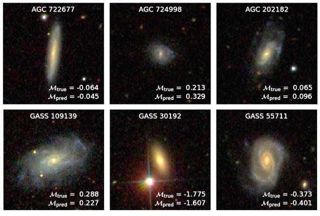
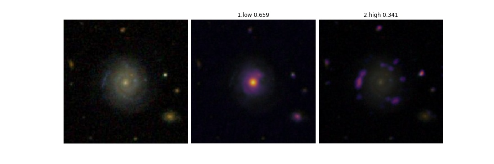

# HI-convnets



## Connecting Optical Morphology, Environment, and HI Mass Fraction for Low-Redshift Galaxies Using Deep Learning

A galaxy's cold gas content can determine its current and future star formation properties. Most of that cold gas in present-day galaxies is in the form of neutral atomic hydrogen (HI), which radiates weakly through a 21-cm emission line. Since it is so difficult to observe this signal, many different heuristics have been developed in order to estimate the HI mass fraction (equivalent to a galaxy's HI mass normalized by its stellar mass). This work aims to improve existing approaches by leveraging all optical imaging information.

We use deep convolutional neural networks to process SDSS *gri* images (spanning 224 x 224 pixels, or roughly 100" x 100") of optical counterparts to HI detections in low-redshift Universe (*z* < 0.05). By using [data augmentation](https://ui.adsabs.harvard.edu/abs/2015MNRAS.450.1441D/abstract), a [one-cycle learning rate schedule](https://arxiv.org/abs/1803.09820), the [Rectified Adam](https://arxiv.org/abs/1908.03265) + [LookAhead](https://arxiv.org/abs/1907.08610) optimizer, and [resnet-34](https://arxiv.org/abs/1512.03385) architecture ([+ bag of tricks](https://arxiv.org/abs/1812.01187) + [Mish activation function](https://arxiv.org/abs/1908.08681)), **we can predict mass fractions to within 0.25 dex RMSE for the SDSS x ALFALFA data set**.

Results can be found in our paper: https://arxiv.org/abs/2001.00018

## Usage

Download this repository by running
```
git clone https://github.com/jwuphysics/HI-convnets.git
cd HI-convnets
```

Results can be replicated by evaluating the Jupyter notebooks in `notebook`, and/or by running the code in `src/train_alfalfa.py` and `src/train_xGASS.py`.

Many of the notebooks can be run on [Google Colab](colab.research.google.com) or via Google Compute Engine; these are named accordingly. They can also be viewed online, e.g., using the [Jupyter `nbviewer`](https://nbviewer.jupyter.org/github/jwuphysics/HI-convnets/blob/master/notebook/COLAB%20-%20Visualizing%20galaxy%20features%20related%20to%20gas%20mass%20fraction.ipynb). Shown below is an example of running Grad-CAM on a trained convnet. An input galaxy (left) is fed forward through the convnet, and the algorithm highlights gas-poor (center) and gas-rich (right) features with overall confidence given by the *p*-values listed above each image.




## Dependencies

Pytorch `>=1.0` and Fastai `>=1.0` are required to run this code. They can be installed together using the Anaconda command

```
conda install -c pytorch -c fastai fastai
```

## Data

All data were queried from the [SDSS DR14 image cutout service](http://skyserver.sdss.org/dr14/en/help/docs/api.aspx#imgcutout) using a download script similar to the one in our [metallicity prediction deep convnet](https://github.com/jwuphysics/galaxy-cnns). See, for example, `src/get_sdss_cutouts.py`. Positions were taken from the ALFALFA [α.40 catalogs](http://egg.astro.cornell.edu/alfalfa/data/) ([Haynes et al. 2011](https://ui.adsabs.harvard.edu/abs/2011AJ....142..170H/abstract)) and [xGASS catalogs](http://xgass.icrar.org/data.html).

## Acknowledgments

This work began during the [MIAPP Programme on Galaxy Evolution](http://www.munich-iapp.de/programmes-topical-workshops/2019/galaxy-evolution/daily-schedule/) and was inspired by conversations with [Mike Jones (IAA)](http://amiga.iaa.es/p/321-Michael-G-Jones.htm) and [Luke Leisman (Valpariso)](https://www.valpo.edu/physics-astronomy/about/faculty-and-staff/lukas-leisman/). Conversations with @jegpeek were also super helpful. Some of this work was also done at the Interstellar Institute meeting, [SO-STAR](https://interstellarinstitute.org/programs/so-star/presentation.html). The Fastai [course](https://course.fast.ai/) and [software](https://github.com/fastai/fastai) developed by Jeremy Howard et al. have been immensely useful for this work. Likewise, the [Grad-CAM implementation](https://github.com/anhquan0412/animation-classification/blob/master/gradcam.py) by @anhquan0412, and [combined RAdam + LookAhead optimizer (aka Ranger)](https://github.com/lessw2020/Ranger-Deep-Learning-Optimizer) by @lessw2020 are used in this work.
