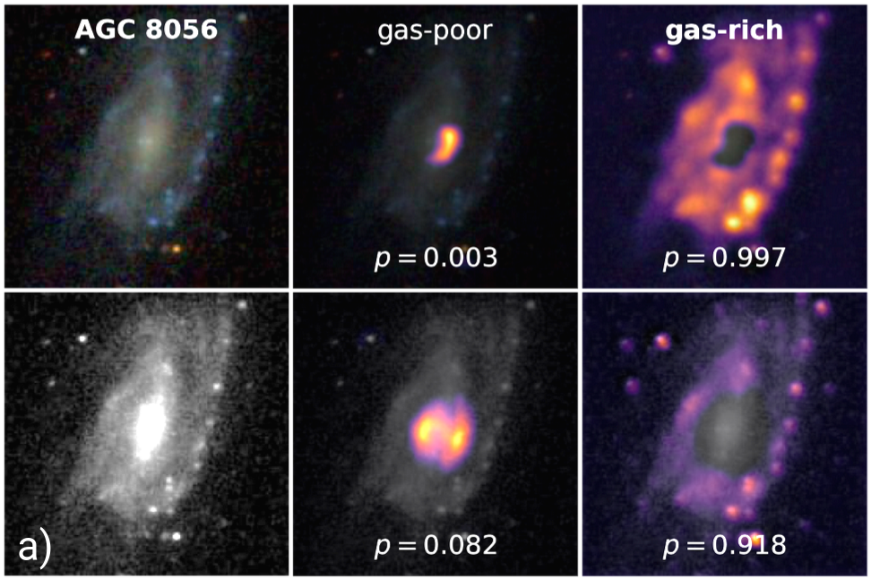

# HI-convnets

<a href="https://ui.adsabs.harvard.edu/abs/2020arXiv200100018W/abstract"></a>
<a href="https://arxiv.org/abs/2001.00018"></a>



## Connecting Optical Morphology, Environment, and HI Mass Fraction for Low-Redshift Galaxies Using Deep Learning

A galaxy's cold gas content can determine its current and future star formation properties. Most of that cold gas in present-day galaxies is in the form of neutral atomic hydrogen (HI), which radiates weakly through a 21-cm emission line. Since it is so difficult to observe this signal, many different heuristics have been developed in order to estimate the HI mass fraction (equivalent to a galaxy's HI mass normalized by its stellar mass). This work aims to improve existing approaches by leveraging all optical imaging information.

We use deep convolutional neural networks to encode SDSS *gri* images (spanning 224 x 224 pixels, or roughly 100" x 100") of optical counterparts to HI detections in low-redshift Universe. We can predict HI mass fractions to within 0.23 dex RMSE for the SDSS x ALFALFA data set using imaging alone. When the CNN is also used for pattern recognition, the combined result outperforms all other machine learning regression methods (e.g., as low as 0.20 dex scatter for an independent ALFALFA data set).

Results can be found in the paper: https://arxiv.org/abs/2001.00018

## Usage

Download this repository by running
```
git clone https://github.com/jwuphysics/HI-convnets.git
cd HI-convnets
```

Note that the most recent results are found in `notebook/updates`, while previous results can be found in `notebook`.


## Dependencies

Pytorch and Fastai `>=2.0` are required to run this code. At the time of this writing, the [`fastai2` library](https://github.com/fastai/fastai2/) is undergoing large changes, and will eventually supercede the [`fastai` repository](https://github.com/fastai/fastai).


## Data

Imaging data were queried from the [SDSS DR14 image cutout service](http://skyserver.sdss.org/dr14/en/help/docs/api.aspx#imgcutout) using a download script similar to the one in our [metallicity prediction deep convnet](https://github.com/jwuphysics/galaxy-cnns). See, for example, `src/get_sdss_cutouts.py`. Galaxy positions for the training data set were taken from the [ALFALFA 40% catalogs](http://egg.astro.cornell.edu/alfalfa/data/) ([Haynes et al. 2011](https://ui.adsabs.harvard.edu/abs/2011AJ....142..170H/abstract)) crossmatched to the SDSS Main Galaxy Sample. The ALFALFA 100%, [xGASS](http://xgass.icrar.org/data.html), and [NIBLES](https://ui.adsabs.harvard.edu/abs/2016A%26A...595A.118V/abstract) catalogs were used as test data sets.

## Citation

```
@ARTICLE{2020arXiv200100018W,
       author = {{Wu}, John F.},
        title = "{Connecting optical morphology, environment, and HI mass fraction for low-redshift galaxies using deep learning}",
      journal = {arXiv e-prints},
     keywords = {Astrophysics - Astrophysics of Galaxies, Astrophysics - Instrumentation and Methods for Astrophysics},
         year = "2019",
        month = "Dec",
          eid = {arXiv:2001.00018},
        pages = {arXiv:2001.00018},
archivePrefix = {arXiv},
       eprint = {2001.00018},
 primaryClass = {astro-ph.GA},
       adsurl = {https://ui.adsabs.harvard.edu/abs/2020arXiv200100018W},
      adsnote = {Provided by the SAO/NASA Astrophysics Data System}
}
```

## Contact

If you have any questions or comments, please reach out via [email](mailto:jwuphysics@gmail.com)!

## Acknowledgments

This work began during the [MIAPP Programme on Galaxy Evolution](http://www.munich-iapp.de/programmes-topical-workshops/2019/galaxy-evolution/daily-schedule/) and was inspired by conversations with [Mike Jones (IAA)](http://amiga.iaa.es/p/321-Michael-G-Jones.htm) and [Luke Leisman (Valpariso)](https://www.valpo.edu/physics-astronomy/about/faculty-and-staff/lukas-leisman/). Conversations with @jegpeek were super helpful. The anonymous ApJ referee also provided lots of useful comments and feedback. Some of this work was also done at the Interstellar Institute meeting, [SO-STAR](https://interstellarinstitute.org/programs/so-star/presentation.html). The Fastai [course](https://course.fast.ai/) and [software](https://github.com/fastai/fastai) developed by Jeremy Howard et al. have been immensely useful for this work. Likewise, the [Grad-CAM implementation](https://github.com/anhquan0412/animation-classification/blob/master/gradcam.py) by @anhquan0412, and [combined RAdam + LookAhead optimizer (aka Ranger)](https://github.com/lessw2020/Ranger-Deep-Learning-Optimizer) by @lessw2020 are used in this work.
